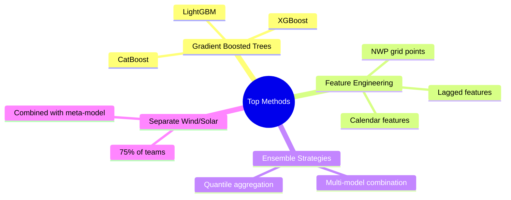
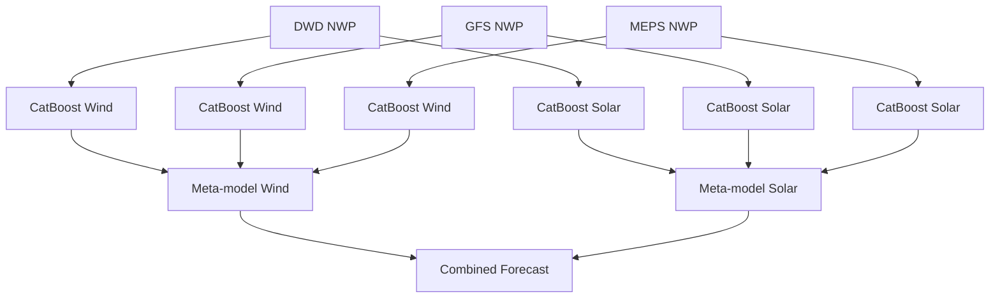

# Trees for Energy Forecasting

Lessons from HEFTCom2024

<div class="abs-br m-6 text-sm opacity-75">
  AI x Energy Tech Meetup
 · January 21, 2026
</div>

---
layout: two-cols
layoutClass: gap-8
---

# About Me

<div class="mt-8">

**Sebastian Haglund**

- Co-founder @ **rebase.energy**
- Background in energy trading
- Love coding in Python ❤️

</div>

::right::

<div class="mt-8">

<div style="text-align: right;">
  
</div>


</div>

---

# Common prediction problems in the energy sector

<div class="grid grid-cols-3 gap-8 mt-16">

<div v-click class="transition-all duration-500">
  
  
  - Power forecasting
  - Icing forecasting
  - Wind speed estimation
  - Anomaly detection
</div>

<div v-click class="transition-all duration-500">
  
  
  - Power forecasting
  - Anomaly detection
</div>

<div v-click class="transition-all duration-500">
  
  
  - Demand forecasting
  - Demand estimation
  - Peak prediction
  - Anomaly detection
</div>

</div>

---

# Why does deep learning struggle with tabular datasets?

<div class="grid grid-cols-3 gap-6 mt-12">

<div v-click class="border-2 border-red-500 rounded-lg p-4 bg-white/5">
  <div class="text-lg font-semibold text-red-400 mb-2">
    "Why do tree-based models still outperform deep learning on tabular data?"
  </div>
  <div class="text-sm opacity-75">
    Léo Grinsztajn, Edouard Oyallon, Gaël Varoquaux<br/>
    NeurIPS 2022
  </div>
</div>

<div v-click class="border-2 border-red-500 rounded-lg p-4 bg-white/5">
  <div class="text-lg font-semibold text-red-400 mb-2">
    "Tabular Data: Deep Learning is Not All You Need"
  </div>
  <div class="text-sm opacity-75">
    Ravid Shwartz-Ziv, Amitai Armon<br/>
    NeurIPS 2021
  </div>
</div>

<div v-click class="border-2 border-red-500 rounded-lg p-4 bg-white/5">
  <div class="text-lg font-semibold text-red-400 mb-2">
    "Deep Neural Networks and Tabular Data: A Survey"
  </div>
  <div class="text-sm opacity-75">
    Vadim Borisov et al.<br/>
    IEEE TNNLS 2022
  </div>
</div>

</div>

<div v-click class="mt-8 text-sm opacity-75">
  <strong>Sources:</strong> 
  <a href="https://arxiv.org/abs/2207.08815" class="text-blue-400">arxiv.org/abs/2207.08815</a>, 
  <a href="https://arxiv.org/abs/2106.03253" class="text-blue-400">arxiv.org/abs/2106.03253</a>, 
  <a href="https://arxiv.org/abs/2110.01889" class="text-blue-400">arxiv.org/abs/2110.01889</a>
</div>

---
layout: center
---

1. What was HEFTCom2024?
2. Why trees dominate energy forecasting
3. The winning approach
4. Key lessons learned
5. Trees vs Deep Learning

# What is HEFTCom2024?

**Hybrid Energy Forecasting and Trading Competition**

<div class="grid grid-cols-3 gap-8 mt-8 text-center">
  <div class="p-4 bg-blue-500/10 rounded-lg">
    <div class="text-3xl font-bold text-blue-400">3.6 GW</div>
    <div class="text-sm opacity-75">Wind + Solar Portfolio</div>
  </div>
  <div class="p-4 bg-green-500/10 rounded-lg">
    <div class="text-3xl font-bold text-green-400">170+</div>
    <div class="text-sm opacity-75">Registered Teams</div>
  </div>
  <div class="p-4 bg-orange-500/10 rounded-lg">
    <div class="text-3xl font-bold text-orange-400">90 days</div>
    <div class="text-sm opacity-75">Live Competition</div>
  </div>
</div>

<div class="mt-8 text-sm opacity-75">
  Organized by IEEE PES Working Group on Energy Forecasting · Sponsored by Ørsted & Rebase Energy
</div>

---

# Competition Setup

<div class="grid grid-cols-2 gap-8">
<div>

## Forecasting Track

- Probabilistic forecasts (quantiles 10-90%)
- Day-ahead horizon
- Scored by **pinball loss**
- Wind: Hornsea 1 (1.2 GW)
- Solar: East of England (2.4 GW)

</div>
<div>

## Trading Track

- Sell energy in day-ahead market
- Subject to imbalance settlement
- Scored by **total revenue**
- Real GB market prices
- Price-maker effect modeled

</div>
</div>

<div class="mt-8 p-4 bg-yellow-500/10 rounded-lg">

**Key Challenge**: Cable fault at Hornsea 1 reduced output mid-competition. Teams had to adapt!

</div>

---

# Competition Results: Pinball Loss

<iframe src="/plotly/heftcom24-pinball.html" class="w-full h-[450px] rounded-lg border-0"></iframe>

---

# Why a Competition?

<div class="grid grid-cols-2 gap-12 mt-8">
<div>

## Problems with Academic Benchmarks

- Different datasets
- Different evaluation criteria
- Potential data leakage
- Hard to reproduce
- Cherry-picked results

</div>
<div>

## Competition Benefits

- Common task & evaluation
- Live = no cheating possible
- Forces practical robustness
- Real operational constraints
- Open dataset for future research

</div>
</div>

---
layout: center
class: text-center
---

# The Results

## Trees Dominated

---

# Top 10 Forecasting Track

| Rank | Team | Pinball (MWh) | Method |
|------|------|---------------|--------|
| 1 | **SVK** | 22.18 | CatBoost |
| 2 | UI BUD | 23.18 | Gradient Boosting |
| 3 | Rnt | 24.64 | AI Weather + Neural Networks |
| 4 | GEB | 25.16 | Gradient Boosting |
| 5 | BridgeForCast | 25.34 | Gradient Boosting |
| 6 | quantopia | 25.38 | (Organizer baseline) |
| 7 | LSEG Power Team | 25.74 | Gradient Boosting |
| 8 | sukantabasu | 27.04 | Gradient Boosting |
| 9 | Stochastic Parrots | 27.50 | Gradient Boosting |
| 10 | EnergiWise | 27.65 | Gradient Boosting |

<div class="mt-4 text-sm opacity-75">
9 of top 10 used gradient boosted trees (CatBoost, XGBoost, LightGBM)
</div>

---

# Methods Used by Teams



---

# Why Do Trees Work So Well?

<div class="grid grid-cols-2 gap-8 mt-4">
<div>

## Strengths for Energy Data

- Handle **tabular data** naturally
- Automatic feature interactions
- Robust to outliers
- Fast training & inference
- No scaling required
- Handle missing values

</div>
<div>

## Perfect Match for NWP Features

- Multiple weather models (GFS, ICON-EU)
- Grid points around sites
- Temporal features (hour, month)
- Lagged observations
- Differenced values

</div>
</div>

<div class="mt-6 p-4 bg-blue-500/10 rounded-lg text-center">

**Key insight**: Energy forecasting is fundamentally a tabular prediction problem with rich NWP features

</div>

---
layout: two-cols
layoutClass: gap-8
---

# The Winning Approach (SVK)

<div class="text-sm">

## Architecture



</div>

::right::

<div class="text-sm">

## Key Details

- **CatBoost** with `MultiQuantile` loss
- Separate models per NWP source
- Features: NWP grids, lagged, differenced
- Only tuned: number of iterations
- Default hyperparameters otherwise!
- Linear quantile regression meta-model
- REMIT data for outage handling

## Extra Data

- MET Norway MEPS forecasts
- 8% improvement from additional NWP

</div>

---

# CatBoost for Quantile Regression

```python {all|3-5|7-12|14-17|all}
from catboost import CatBoostRegressor

# Native multi-quantile support
quantiles = [0.1, 0.2, 0.3, 0.4, 0.5, 0.6, 0.7, 0.8, 0.9]
loss_function = f'MultiQuantile:alpha={",".join(map(str, quantiles))}'

model = CatBoostRegressor(
    iterations=1000,
    loss_function=loss_function,
    learning_rate=0.1,
    depth=6,  # default
)

model.fit(X_train, y_train)
predictions = model.predict(X_test)  # Shape: (n_samples, 9)
# Each column is a quantile prediction
```

<div class="mt-4 text-sm opacity-75">

Pro tip: CatBoost's MultiQuantile is faster than training 9 separate models

</div>

---

# Feature Engineering That Mattered

<div class="grid grid-cols-2 gap-8">
<div>

## Weather Features

```python
# NWP grid points (not just site location)
for lat in grid_lats:
    for lon in grid_lons:
        features.append(f'wind_speed_{lat}_{lon}')
        features.append(f'wind_dir_{lat}_{lon}')

# Temporal differences
features.append('wind_speed_diff_1h')
features.append('wind_speed_diff_3h')

# Lagged values
features.append('wind_speed_lag_24h')
```

</div>
<div>

## Calendar Features

```python
# Time-based patterns
features.append('hour_of_day')
features.append('day_of_week')
features.append('month')
features.append('is_weekend')

# Cyclical encoding
features.append('hour_sin')
features.append('hour_cos')
```

</div>
</div>

---

# Forecasting vs Trading Performance

<div class="text-center">

**Better forecasts → Better trading, but strategy matters too**

</div>

```mermaid {scale: 0.8}
%%{init: {'theme': 'dark'}}%%
xychart-beta
    title "Pinball Score vs Revenue"
    x-axis "Pinball Score (MWh)" [22, 25, 28, 31, 34, 37]
    y-axis "Revenue (£m)" [83, 85, 87, 89]
    line [88.8, 88.2, 87.5, 84.3, 85.5, 84.4]
```

<div class="mt-4 text-sm">

- **Correlation exists** but not perfect (r² ≈ 0.7)
- Strategic bidding added **£500k+** for top teams
- Teams with similar forecasts had different revenues

</div>

---

# Trading Strategy Insights

<div class="grid grid-cols-2 gap-8">
<div>

## Naive Approach

Bid the 50% quantile (expected value)

$$x = \hat{q}_{50\%}$$

Works when price spread is zero

</div>
<div>

## Optimal Bidding

$$x_{opt} = y - \frac{\pi_S - \pi_D}{0.14}$$

Where:
- $y$ = actual production (unknown)
- $\pi_S$ = imbalance price (unknown)
- $\pi_D$ = day-ahead price

</div>
</div>

<div class="mt-6 p-4 bg-green-500/10 rounded-lg">

**SVK's approach**: Turned decision problem into prediction problem. Trained trees to predict optimal bid directly!

</div>

---

# Trees vs Deep Learning

<div class="grid grid-cols-2 gap-8 mt-4">
<div>

## When Trees Win

- Tabular/structured data
- Limited training data
- Need for interpretability
- Fast iteration required
- Mixed feature types
- **Day-ahead energy forecasting**

</div>
<div>

## When Deep Learning Wins

- Sequence-to-sequence tasks
- Image/spatial data
- Very large datasets
- End-to-end learning needed
- Transfer learning valuable

</div>
</div>

<div class="mt-6 p-4 bg-orange-500/10 rounded-lg">

**Notable exception**: Team Rnt (3rd place) used AI weather model embeddings + neural networks. Shows potential for hybrid approaches!

</div>

---

# Practical Tips from HEFTCom2024

<v-clicks>

1. **Start with gradient boosted trees** (CatBoost, XGBoost, LightGBM)

2. **Use multiple NWP sources** - 8% improvement from adding MEPS

3. **Forecast wind and solar separately** - 75% of top teams did this

4. **Feature selection matters** - Drop unimportant features after testing

5. **Default hyperparameters work** - Don't over-tune

6. **Build robust pipelines** - Handle missing NWP data gracefully

7. **Monitor REMIT** - Outages happen, be prepared

</v-clicks>

---

# Open Dataset Available

All competition data is freely available for benchmarking:

<div class="grid grid-cols-2 gap-8 mt-8">
<div>

## Data Includes

- 3 years of NWP forecasts (GFS, ICON-EU)
- Wind & solar production
- Electricity prices (DA + imbalance)
- All participant submissions
- Methodology reports

</div>
<div>

## Links

- **Data**: [doi.org/10.5281/zenodo.13950764](https://doi.org/10.5281/zenodo.13950764)
- **Code**: [github.com/jbrowell/HEFTcom24](https://github.com/jbrowell/HEFTcom24)
- **Paper**: Browell et al. (2025), Int. J. Forecasting

</div>
</div>

<div class="mt-8 text-center text-sm opacity-75">

Perfect for benchmarking your next energy forecasting model!

</div>

---
layout: center
class: text-center
---

# Key Takeaways

<div class="grid grid-cols-3 gap-8 mt-8">
  <div class="p-6 bg-blue-500/10 rounded-lg">
    <div class="text-4xl mb-4">🌲</div>
    <div class="font-bold">Trees Still Win</div>
    <div class="text-sm opacity-75 mt-2">For tabular energy forecasting, gradient boosted trees remain state-of-the-art</div>
  </div>
  <div class="p-6 bg-green-500/10 rounded-lg">
    <div class="text-4xl mb-4">🔧</div>
    <div class="font-bold">Implementation > Algorithm</div>
    <div class="text-sm opacity-75 mt-2">Feature engineering and data handling matter more than model choice</div>
  </div>
  <div class="p-6 bg-orange-500/10 rounded-lg">
    <div class="text-4xl mb-4">💰</div>
    <div class="font-bold">Forecast ≠ Value</div>
    <div class="text-sm opacity-75 mt-2">Trading strategy can be as important as forecast accuracy</div>
  </div>
</div>

---
layout: center
class: text-center
---

# Thank You!

<div class="mt-8">

Questions?

</div>

<div class="mt-12 text-sm opacity-75">

**Sebastian Haglund** · Rebase Energy

[rebase.energy](https://rebase.energy) · [@reaborned](https://twitter.com/reaborned)

</div>

<div class="abs-br m-6 text-xs opacity-50">
  Slides: github.com/sebaheg/slidev
</div>
